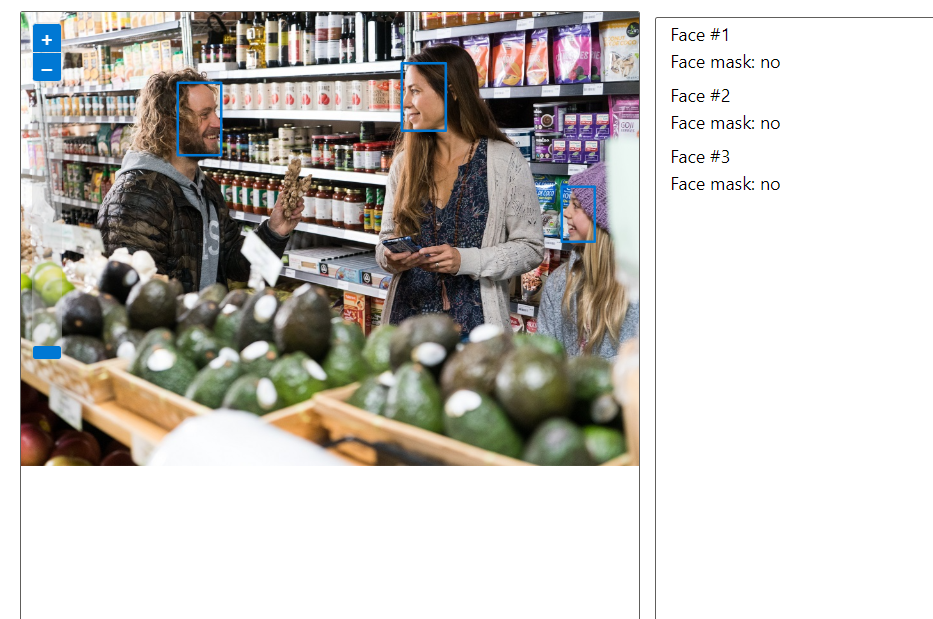

# Reconhecimento Facial e transformação de imagens em Dados no Azure ML

Este repositório demonstra como utilizar o Azure Machine Learning e os Azure AI Services para realizar Detecção Facial, Reconhecimento Óptico de Caracteres (OCR) e Análise de Imagem. O objetivo é aplicar essas tecnologias para extrair informações de imagens de maneira automatizada.

# Tecnologias Utilizadas
    
   - Face API (Detecção Facial)
   - Computer Vision API (Análise de Imagem e OCR)

# Funcionalidades
    1. Detecção Facial
Objetivo: Identificar rostos em imagens e vídeos.
Uso: Segurança, personalização e análise de emoções.

    2. OCR (Reconhecimento Óptico de Caracteres)
Objetivo: Extrair texto de imagens.
Uso: Digitalização de documentos e acessibilidade.
    3. Análise de Imagem
Objetivo: Gerar descrições automáticas para imagens.
Uso: Acessibilidade, marketing e indexação de conteúdo.
Instalação
