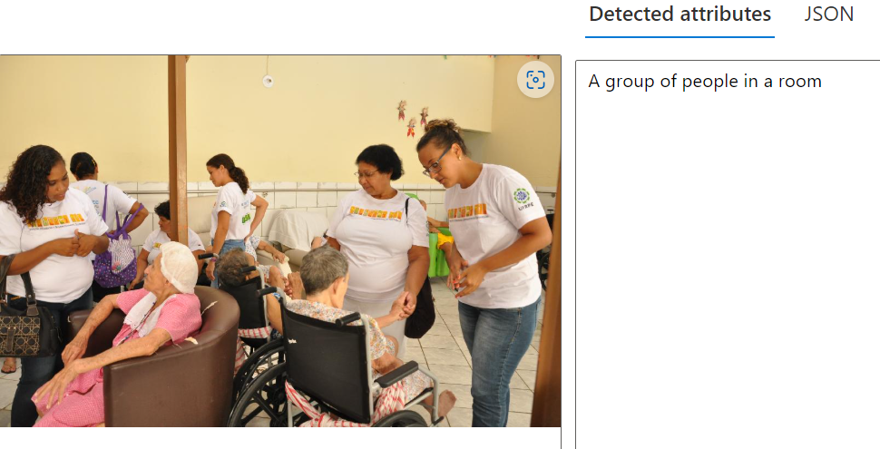

#              Reconhecimento Facial e transformação de imagens em Dados no Azure ML                                                                                                                                            
Este repositório demonstra como utilizar o Azure Machine Learning e os Azure AI Services para realizar Detecção Facial, Reconhecimento Óptico de Caracteres (OCR) e Análise de Imagem.  O objetivo é aplicar essas tecnologias para extrair informações de imagens de maneira automatizada.

# Tecnologias Utilizadas
    
   - Face API (Detecção Facial)
   - Computer Vision API (Análise de Imagem e OCR)

# Funcionalidades

     Detecção Facial
  - Objetivo: Identificar e verificar rostos em imagens ou vídeos.
  - Uso: Segurança, personalização e análise de emoções.
  
  

-------------------------------------------------------------------------------------------------

      OCR (Reconhecimento Óptico de Caracteres)
- Objetivo: Converter texto em imagens (como fotos ou documentos) para texto editável.
- Uso: Digitalização de documentos físicos,Extração de informações de formulários, recibos, e contratos.
    Criação de soluções acessíveis para deficientes visuais
    

  
  
  

----------------------------------------------------------------------------------------------

      Análise de Imagem    
- Objetivo: Gerar descrições automáticas para imagens.
- Uso: Acessibilidade, marketing e indexação de conteúdo.

----------------------------------------------------------------------------------------------

